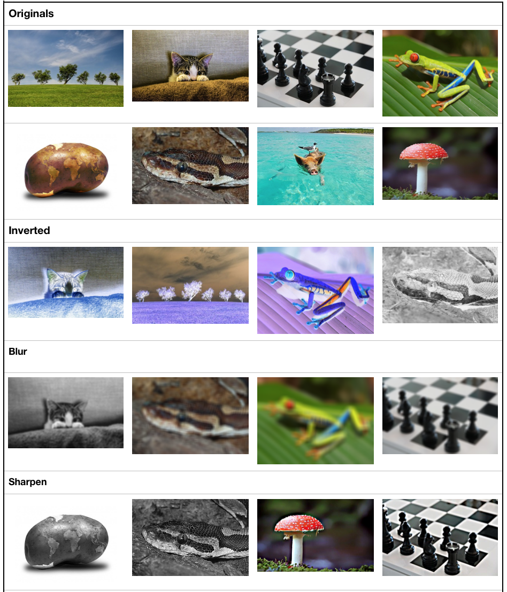
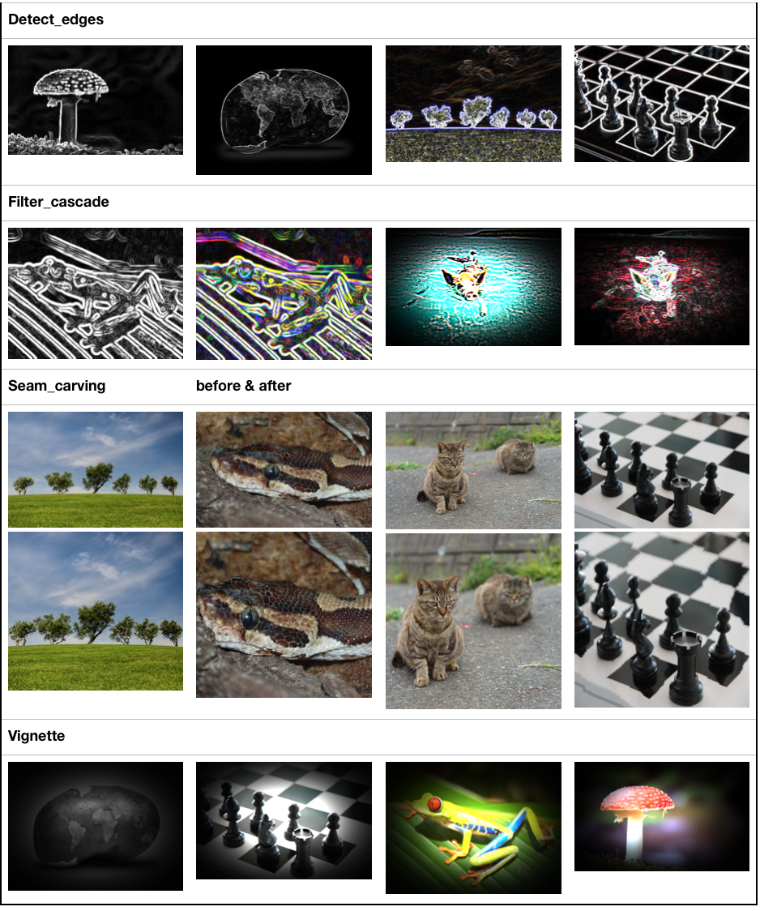

# image_manipulation with python and Pillow

## Part 1 -  greyscale image manipulation. Wow factor: sharpened/unsharp mask, and edges (a Sobel operator)

* def correlate(image, kernel): Image Filtering via Correlation

* def blurred(image, n): Blurring with Box blur

* def sharpened(image, n):
    * A sharpen filter, aka an unsharp mask because it results from subtracting an "unsharp" (blurred) version of the image from a scaled version of the original image. If we have an image (IM) and a blurred version of that same image (B), the value of the sharpened image (S) at a particular location is:
    * S_{x,y} = 2IM_{x,y} - B_{x,y}

* def edges(image): Sobel operator, a neat (super cool!) filter, uses for detecting edges in images.

## Part 2 - color image manipulation, making use of functional programming. Wow factor: filter_cascade, seam_carving, vignette.

* def color_filter_from_greyscale_filter - convert greyscale_filters implemented so far into color_filters that work on color images

* def filter_cascade (work of wonder) - cascading filters into one super-powered filter: functional chaining, 9 levels high

* def seam_carving - content-aware resizing i.e. retargeting (such a dope technique)

* def vignette: apply Gaussian Kernel (~cv2 getGaussianKernel, and compute Frobenius matrix norm~ numpy.linalg.norm).

* //TODO seam filling - smart resizing to increase the size of an image by inserting appropriate rows at low-energy regions in the image.

### And it's show time: (find more in /show)

